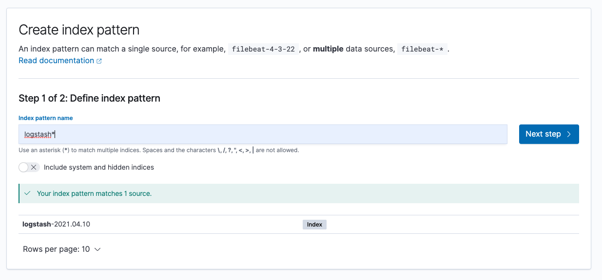
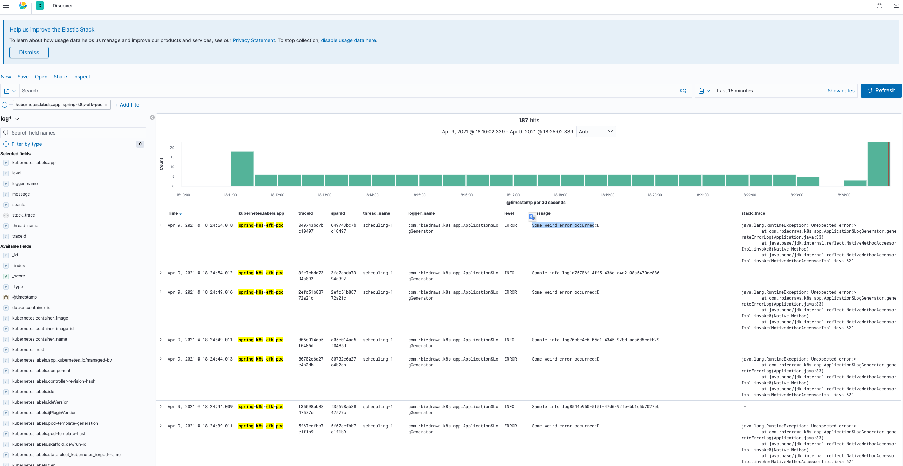

# Cluster-level centralized logging in Kubernetes with EFK stack (PoC)

This repository contains EFK (Elasticsearch, Fluentd, and Kibana) **centralized logging** setup for applications running inside **kubernetes** cluster.

Setup contains custom Fleuntd match and filters directives, that can be activated using kubernetes label `logtype: "json"` (for matching json formatted logs).

## Features

* Centralized logging inside kubernetes cluster.
* **Elasticsearch** setup for log storage.  
* Configured node-level logging agent (**Fluentd DaemonSet**).
* **Kibana** setup for log visualization.
* Sample spring boot microservice with configured logging (json format).
* Custom **Fluentd directive** for matching containers marked with k8s `logtype=json`.

## Getting Started

### Prerequisite

* Java 11
* Docker
* Kubernetes

### Usage

* Build docker image.
  ```shell
  ./gradlew bootBuildImage
  ```

* Deploy sample microservice into k8s cluster.
  ```shell
  # create demo namspace
  kubectl create -f k8s/namespace.yml
  
  # apply deployment and service definitions
  kubectl apply -f k8s/
  ```

* Create logging namespace.
  ```shell
  kubectl create -f ./k8s/efk/namespace.yml
  ```
* Deploy elasticsearch cluster (3 nodes).
  ```shell
  kubectl create -f ./k8s/efk/elasticsearch/
  ```

* Deploy Kibana.
  ```shell
  kubectl create -f ./k8s/efk/kibana/
  ```
  *** *rollout may take some time.*

* Deploy Fluentd DaemonSet.
  ```shell
  # add custom configuration
  kubectl create configmap fluentd-conf --from-file=./k8s/efk/fluentd/kubernetes.conf --namespace=efk-logging
  
  # Add necessary permissions
  kubectl create -f ./k8s/efk/fluentd/fluentd.rbac.yml
  
  # Start DaemonSet
  kubectl create -f ./k8s/efk/fluentd/fluentd.daemon.set.yml
  ```

* Port forward Kibana dashboard.
  ```shell
  kubectl port-forward -n efk-logging svc/kibana 8081:5601
  ```
  *** *EFK setup may take, so please be patient.*

* Open your web browser and go to [Kibana dashboard page](http://localhost:8081/).

* Click `Discover` tab and then click `Create index pattern`. 

* Use `logstash*` pattern, see picture below.
  
  
  

* After successful setup visit `Discover` tab again, logs should be visible (see screenshot below).
  
  
* Uninstall `PoC` from k8s cluster.
  ```shell
  # Remove all components from 'efk-logging' namespace
  kubectl delete all --all -n efk-logging
  kubectl delete namespace efk-logging
  
  # Remove all components from 'spring-k8s-efk-poc' namespace
  kubectl delete all --all -n spring-k8s-efk-poc
  kubectl delete namespace spring-k8s-efk-poc
  ```

## References

[Kubernetes DaemonSet](https://kubernetes.io/docs/concepts/workloads/controllers/daemonset/)
[Cluster-level Logging in Kubernetes with Fluentd](https://medium.com/kubernetes-tutorials/cluster-level-logging-in-kubernetes-with-fluentd-e59aa2b6093a)
[Fluentd config - kubernetes.conf](https://github.com/fluent/fluentd-kubernetes-daemonset/blob/master/docker-image/v1.11/debian-elasticsearch7/conf/kubernetes.conf)

## License

Distributed under the MIT License. See `LICENSE` for more information.
